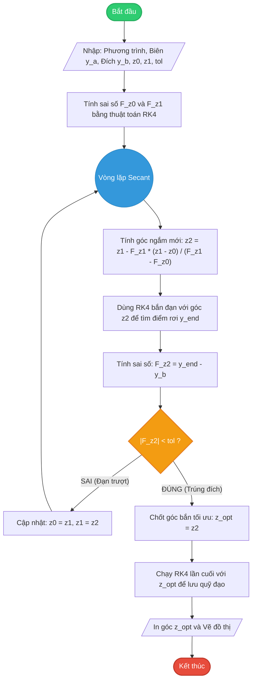

# TÀI LIỆU HƯỚNG DẪN: PHƯƠNG PHÁP BẮN (SHOOTING METHOD) TỪ CON SỐ 0

## 1. Giới thiệu (Introduction)

Dự án này cung cấp một bộ công cụ tự viết hoàn toàn bằng Python (không phụ thuộc vào thư viện bên ngoài như `scipy`) để giải **Bài toán điều kiện biên hai điểm (Boundary Value Problem - BVP)** bằng **Phương pháp bắn (Shooting Method)**. 

Thay vì sử dụng các thuật toán có sẵn, dự án này minh bạch hóa toàn bộ quá trình toán học bên dưới bằng cách tự xây dựng:
* Thuật toán **Runge-Kutta bậc 4 (RK4)** để giải phương trình vi phân.
* Thuật toán **Cát tuyến (Secant Method)** để dò tìm góc bắn tối ưu.

**Bài toán mẫu mặc định trong dự án:**
* Phương trình vi phân: $y'' = -y$
* Điều kiện biên: $y(0) = 1$ và $y\left(\frac{\pi}{2}\right) = 0$
* Nghiệm chính xác kỳ vọng: $y(x) = \cos(x)$

---

## 2. Cơ sở toán học (Mathematical Foundation)

Phương pháp bắn biến BVP thành một bài toán giá trị ban đầu (Initial Value Problem - IVP) kết hợp với việc tìm nghiệm của phương trình đại số.

### Bước 1: Hạ bậc phương trình (BVP -> IVP)
Không gian trạng thái được mở rộng để đưa phương trình bậc hai về hệ phương trình vi phân bậc nhất. Đặt $y_1 = y$ và $y_2 = y'$. Ta có hệ:
$$y_1' = y_2$$
$$y_2' = -y_1$$

Tại $x = 0$, ta đã biết $y_1(0) = 1$, nhưng đạo hàm $y_2(0)$ hoàn toàn vô định. Ta gọi giá trị này là tham số $z$ (góc bắn).

### Bước 2: Thiết lập hàm mục tiêu
Với mỗi giá trị $z$, hệ IVP sinh ra một quỹ đạo nghiệm $y_1(x, z)$. Khi tích phân quỹ đạo này đến điểm cuối $x = \frac{\pi}{2}$, ta thu được tọa độ điểm rơi $y_1\left(\frac{\pi}{2}, z\right)$.
Hàm mục tiêu $F(z)$ được định nghĩa là độ lệch giữa điểm rơi và đích đến thực tế:
$$F(z) = y_1\left(\frac{\pi}{2}, z\right) - 0$$
Bài toán trở thành: **Tìm nghiệm $z$ sao cho $F(z) = 0$.**

### Bước 3: Thuật toán giải
1. **Runge-Kutta bậc 4 (RK4):** Xấp xỉ tích phân hệ phương trình vi phân bằng cách lấy trung bình cộng có trọng số của 4 độ dốc ($k_1, k_2, k_3, k_4$) tại mỗi bước nhảy $h$:
   $$\mathbf{Y}_{n+1} = \mathbf{Y}_n + \frac{h}{6}(k_1 + 2k_2 + 2k_3 + k_4)$$
2. **Phương pháp Cát tuyến (Secant Method):** Tìm nghiệm của $F(z) = 0$ bằng công thức lặp:
   $$z_{n+1} = z_n - F(z_n) \frac{z_n - z_{n-1}}{F(z_n) - F(z_{n-1})}$$

---

## 3. Cấu trúc dự án và Giải thích mã nguồn

Dự án gồm 2 file chính đặt cùng thư mục:

### 3.1. Thư viện Lõi: `my_solvers.py`
File này đóng vai trò như một thư viện mini chứa hai hàm toán học cốt lõi:
* `solve_ivp_custom(fun, t_span, y0, ...)`: Giải IVP bằng thuật toán RK4. Kết quả trả về chứa mảng thời gian `t` và mảng giá trị `y`.
* `root_scalar_secant(fun, x0, x1, tol, max_iter)`: Dò tìm nghiệm phương trình bằng phương pháp Cát tuyến. Nó sẽ liên tục thay đổi phỏng đoán $z$ cho đến khi sai số nhỏ hơn mức cho phép.

### 3.2. Kịch bản chính: `main.py`
File này định nghĩa bài toán vật lý và gọi các công cụ từ thư viện lõi để giải:
1.  **Hàm `system(x, Y)`**: Định nghĩa hệ phương trình bậc nhất đã được hạ bậc.
2.  **Hàm `objective(z)`**: Hàm đo lường độ trượt. Nó nhận vào góc bắn $z$, gọi RK4 bắn thử một đường đạn, và trả về khoảng cách từ điểm rơi tới đích.
3.  **Dò nghiệm và Vẽ đồ thị**: Gọi hàm Secant để tìm góc bắn chuẩn `z_opt`, sau đó bắn một phát đạn cuối cùng để lấy quỹ đạo và dùng Matplotlib vẽ lên đồ thị.

---

## 4. Hướng dẫn chạy chương trình

1.  Đảm bảo bạn đã cài đặt các thư viện cơ bản (NumPy và Matplotlib):
    ```bash
    pip install numpy matplotlib
    ```
2.  Mở terminal, di chuyển đến thư mục chứa code và chạy file main:
    ```bash
    python main.py
    ```
3.  **Kết quả:** Terminal sẽ in ra góc bắn tối ưu (khoảng $0.0000$), và một cửa sổ đồ thị sẽ hiển thị quỹ đạo đạn bay khớp hoàn hảo với đường $\cos(x)$.

---

## 5. Hướng dẫn mở rộng: Tùy biến cho phương trình bất kỳ

Để giải một phương trình dạng $y'' = f(x, y, y')$ với điều kiện $y(a) = \alpha$ và $y(b) = \beta$, bạn KHÔNG CẦN sửa file `my_solvers.py`. Chỉ cần điều chỉnh 4 vị trí trong file `main.py`:

**Bước 1: Sửa phương trình vật lý (Hàm `system`)**
Cập nhật phương trình $y_2' = y''$ mới.

**Bước 2: Sửa Hàm mục tiêu (`objective`)**
Cập nhật điểm đầu $a$, điểm cuối $b$, điều kiện ban đầu $\alpha$ và mục tiêu sai số $\beta$.

**Bước 3 & 4: Sửa lời gọi hàm giải và vẽ đồ thị**
Cập nhật lại khoảng $[a, b]$ trong hàm gọi `solve_ivp_custom` cuối cùng.

### Ví dụ thực hành: Giải phương trình Parabol
* Phương trình: $y'' = 2$
* Miền không gian: $x \in [0, 1]$
* Điều kiện biên: $y(0) = 1$ và $y(1) = 3$

Cách sửa `main.py`:

```python
import numpy as np
import matplotlib.pyplot as plt
from my_solvers import solve_ivp_custom, root_scalar_secant

# 1. PHƯƠNG TRÌNH: y'' = 2
def system(x, Y):
    y1, y2 = Y
    return [y2, 2.0]  # y2' = y'' = 2

# 2. HÀM MỤC TIÊU & SAI SỐ
def objective(z):
    # Bắn từ x=0 đến x=1. Tại x=0, y=1. Góc bắn thử là z.
    sol = solve_ivp_custom(system, [0, 1], [1.0, z])
    y_end = sol.y[0, -1] 
    return y_end - 3.0  # Tại x=1, ta muốn y=3.

# 3. TÌM GÓC BẮN
res = root_scalar_secant(objective, x0=0.0, x1=5.0)
z_opt = res.root
print(f"Góc bắn tối ưu y'(0) = {z_opt:.6f}") # Kết quả sẽ là 1.000000

# 4. GIẢI VÀ VẼ
sol_opt = solve_ivp_custom(system, [0, 1], [1.0, z_opt], t_eval=np.linspace(0, 1, 50))
y_exact = sol_opt.t**2 + sol_opt.t + 1 # Nghiệm chính xác: x^2 + x + 1

plt.plot(sol_opt.t, sol_opt.y[0], 'o-', label='Phương pháp bắn')
plt.plot(sol_opt.t, y_exact, 'k--', label='Nghiệm chính xác')
plt.legend()
plt.grid(True)
plt.show()

```

---

## 6. Sơ đồ code


